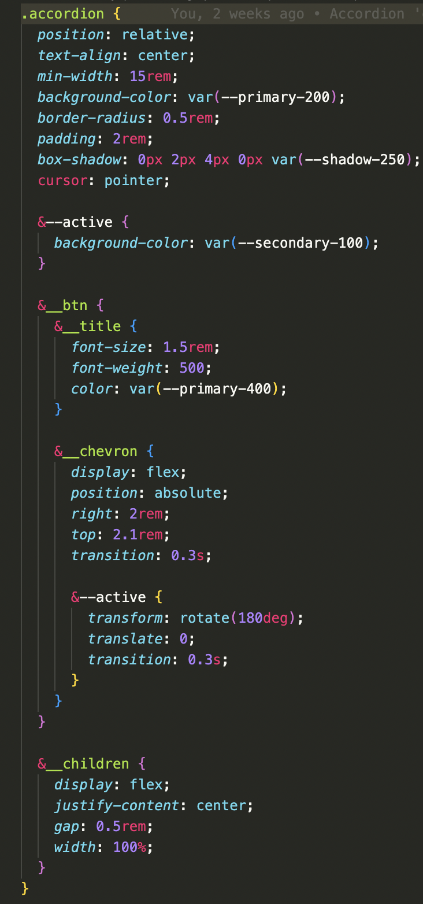
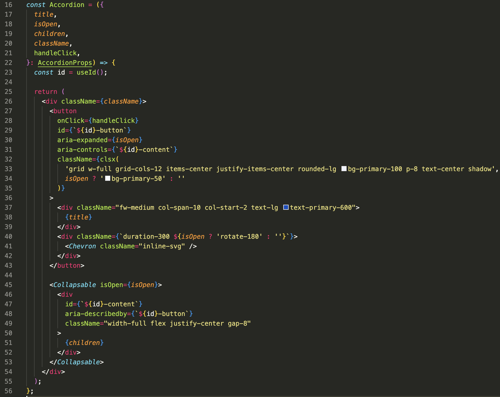

---
# try also 'default' to start simple
theme: default
# random image from a curated Unsplash collection by Anthony
# like them? see https://unsplash.com/collections/94734566/slidev
background: https://images.unsplash.com/photo-1495401220594-550313c3046b?ixlib=rb-4.0.3&ixid=MnwxMjA3fDB8MHxwaG90by1wYWdlfHx8fGVufDB8fHx8&auto=format&fit=crop&w=2064&q=80
# apply any windi css classes to the current slide
class: "text-center"
# https://sli.dev/custom/highlighters.html
highlighter: shiki
# show line numbers in code blocks
lineNumbers: false
# some information about the slides, markdown enabled
info: |
  ## Slidev Starter Template
  Presentation slides for developers.

  Learn more at [Sli.dev](https://sli.dev)
# persist drawings in exports and build
drawings:
  persist: false
# page transition
transition: fade-out
# use UnoCSS
css: unocss
---

# TailwindCss

  
    Press Space for next page <carbon:arrow-right class="inline"/>
  

---

# What is tailwind

Tailwind is a utility first css framework which generates simple atomic classes, so you can style apps quickly without sacrificing _much_ customizability

--- #3

# Looking at this makes me feel ill

  

    

      If you can suppress the urge to retch long enough to give it a chance, I really think you’ll wonder how you ever worked with CSS any other way.
    

    <Quote/>
  

--- #4

# Common issues with tailwind

That is an extreme example, but lets look at some issues with tailwind

- Classlist gets long and hard to read
- Hard to reuse code

--- #5

# Keem's experience

 

## Things I Loved

1. James is Tailwind God and he bestowed his blessing upon us
2. SPEED - instant gratification
3. UTILITY - Padding, hover states, custom components

 

## Things To Consider

1. How much is too much?
2. Still need css modules in speific cases - Layouts

--- #6

## Before

--- #7

## After

